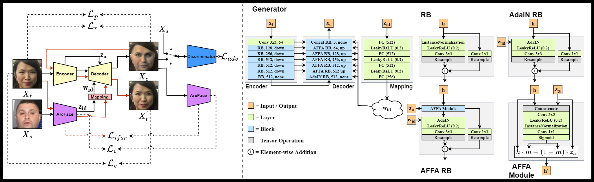

<div align="center">

# <b>FaceDancer: Pose- and Occlusion-Aware High Fidelity Face Swapping</b>


[](https://arxiv.org/abs/2210.10473) [](https://creativecommons.org/licenses/by-nc-sa/4.0/)  [](https://github.com/felixrosberg/FaceDancer)  [](https://huggingface.co/spaces/felixrosberg/face-swap) <a href="https://colab.research.google.com/github/felixrosberg/FaceDancer/blob/main/FaceDancer_colab_demo.ipynb"></a>

[[**WACV 2023**](https://openaccess.thecvf.com/content/WACV2023/html/Rosberg_FaceDancer_Pose-_and_Occlusion-Aware_High_Fidelity_Face_Swapping_WACV_2023_paper.html)] [[**Video Results**](https://drive.google.com/drive/folders/1hHjK0W-Oo1HD6OZb97IdSifPs4_c6NNo?usp=sharing)]

</div>


#### 🚩 Updates:
#### **06.01.2023:**


- Dockerfile and API examples provided by [AliYqb](https://github.com/AliYqb).
#### **03.01.2023:**


- Minor code improvements. Fixed ```No module named 'retinaface.models'``` error (thanks to [kambiannan](https://github.com/kambiannan)).
- Added ability to use a GIF as an input file and export the final result to GIF or WEBP. For more information, check the updated [installation guide](https://github.com/felixrosberg/FaceDancer#installation).


## Abstract
>In this work, we present a new single-stage method for
>subject agnostic face swapping and identity transfer, named
>FaceDancer. We have two major contributions: Adaptive
>Feature Fusion Attention (AFFA) and Interpreted Feature
>Similarity Regularization (IFSR). The AFFA module is embedded
> in the decoder and adaptively learns to fuse attribute
> features and features conditioned on identity information
> without requiring any additional facial segmentation process.
>In IFSR, we leverage the intermediate features
> in an identity encoder to preserve important attributes
> such as head pose, facial expression, lighting, and occlusion
> in the target face, while still transferring the identity
> of the source face with high fidelity. We conduct extensive
> quantitative and qualitative experiments on various
> datasets and show that the proposed FaceDancer outperforms
> other state-of-the-art networks in terms of identity
> transfer, while having significantly better pose preservation
> than most of the previous methods.



For a quick play around, you can check out a version of FaceDancer hosted on [Hugging Face](https://huggingface.co/spaces/felixrosberg/face-swap). The Space allow you to face swap images, but also try some other functionality I am currently researching, which I plan to publish soon. For example, reconstruction attacks and adversarial defense against the reconstruction attacks.


## Getting Started
This project was implemented in TensorFlow 2.X. For evaluation we used models implemented in both TensorFlow and PyTorch (e.g CosFace from [InsightFace](https://github.com/deepinsight/insightface/blob/master/recognition/arcface_torch)).

### Installation:
#### Here is an example of installing FaceDancer on Windows:

- Clone or download repository
```shell
git clone https://github.com/felixrosberg/FaceDancer.git
cd FaceDancer
```

- Make conda environment
```shell
conda create -n facedancer python=3.8
conda activate facedancer
python -m pip install --upgrade pip
```

- Download and install [Microsoft Visual C++ for Visual Studio 2015](https://support.microsoft.com/help/2977003/the-latest-supported-visual-c-downloads?utm_source=www.tensorflow.org&utm_medium=referral) (if you not installed it)

- The easiest way to run FaceDancer on GPU is to install **tensorflow-cpu** and **tensorflow-directml-plugin**. if you need only a CPU, then the installation of **tensorflow-directml-plugin** can be skipped. To work with the GPU, the latest Nvidia driver must be installed.

```shell
conda install -c conda-forge ffmpeg

pip install tensorflow-cpu==2.10
pip install tensorflow-directml-plugin
```

- Install depencies:
```shell
pip install -r requirements.txt
```


#### An alternative installation method if you have difficulty with the previous:
- Clone or download repository
```shell
git clone https://github.com/felixrosberg/FaceDancer.git
cd FaceDancer
```

- Make conda environment
```shell
conda create -n facedancer python=3.8
conda activate facedancer
python -m pip install --upgrade pip
```

- Install depencies:
```shell
conda install -c conda-forge cudatoolkit cudnn
conda install -c conda-forge ffmpeg

pip install tensorflow-gpu
pip install -r requirements.txt
```

#### Models:
Download the pretrained ArcFace **[here](https://huggingface.co/felixrosberg/ArcFace)** (only **ArcFace-Res50.h5** is needed for swapping) and RetinaFace **[here](https://huggingface.co/felixrosberg/RetinaFace)**. Secondly you need to train FaceDancer or **download a pretrained model weights from [here](https://huggingface.co/felixrosberg/FaceDancer)**.
- Put **ArcFace-Res50.h5** inside the **./arcface_model** dir.
- Put **RetinaFace-Res50.h5** inside the **./retinaface** dir.
- Put downloaded pretrained models inside the **./model_zoo** dir.

#
### To swap all faces with one source, run:
> **Warning**
>#### *Source image with too high resolution may not work properly!*
#### Video:
```shell
python test_video_swap_multi.py --facedancer_path "./model_zoo/FaceDancer_config_c_HQ.h5" --vid_path "path/to/video.mp4" --swap_source "path/to/source_face.jpg" --vid_output "results/swapped_video.mp4"
```

#### Image:
```shell
python test_image_swap_multi.py --facedancer_path "./model_zoo/FaceDancer_config_c_HQ.h5" --img_path "path/to/image.jpg" --swap_source "path/to/source_face.jpg" --img_output "results/swapped_image.jpg"
```


#### GIF:
```shell
python test_video_swap_multi.py --facedancer_path "./model_zoo/FaceDancer_config_c_HQ.h5" --vid_path "path/to/GIF_or_MP4.gif" --swap_source "path/to/source_face.jpg" --vid_output "results/swapped_GIF_or_WEBP.gif"
```


> **Note**
>
> *You can use video or GIF as input file, so that the final file will be in GIF or WEBP format, just change the extension in **--vid_output** to **.gif** or **.webp**.*


#### *The video, GIF or image with swapped faces will be saved in the **./results** directory*


## Using the Models in Custom script
```python
import logging

import cv2
import numpy as np
from PIL import Image
from tensorflow.keras.models import load_model
from tensorflow_addons.layers import InstanceNormalization

from networks.layers import AdaIN, AdaptiveAttention

logging.getLogger().setLevel(logging.ERROR)


model = load_model("path/to/model.h5", compile=False, custom_objects={"AdaIN": AdaIN,
                                                                      "AdaptiveAttention": AdaptiveAttention,
                                                                      "InstanceNormalization": InstanceNormalization})
arcface = load_model("path/to/arcface.h5", compile=False)

# target and source images need to be properly cropeed and aligned
target = np.asarray(Image.open("path/to/target_face.png").resize((256, 256)))
source = np.asarray(Image.open("path/to/source_face.png").resize((112, 112)))

source_z = arcface(np.expand_dims(source / 255.0, axis=0))

face_swap = model([np.expand_dims((target - 127.5) / 127.5, axis=0), source_z]).numpy()
face_swap = (face_swap[0] + 1) / 2
face_swap = np.clip(face_swap * 255, 0, 255).astype('uint8')

cv2.imwrite("./swapped_face.png", cv2.cvtColor(face_swap, cv2.COLOR_BGR2RGB))
```


> **Note**
>
> *The important part is that you need ArcFace as well and make sure the target image is normalized between -1 and 1, and the source between 0 and 1.*


## How to Preprocess Data

### Aligning Faces
Before you can train FaceDancer you must make sure the data is properly aligned and processed. Learning capabilites is crippled without this step, if not impossible. The expected folder structure is DATASET/subfolders/im_0, ..., im_x. If using an image dataset not divided into subfolders you can put the DATASET folder inside a parent folder like this: PARENT_FOLDER/DATASET/im_0, ..., im_x. Then specify the PARENT_FOLDER as the --data_dir and the DATASET will be treated as a subfolder. This step requires the pretrained RetinaFace for face detection and facial landmark extraction.

To align the faces run:
```shell
python dataset/crop_align.py --data_dir path/to/DATASET --target_dir path/to/processed_DATASET
```

Remaining arguments consist of:
- **--device_id, default=0** - *Which device to use.*
- **--im_size, default=256** - *Final image size of the processed image.*
- **--min_size, default=128** - *Threshold to ignore image with a width or height lower than min_size.*
- **--shrink_factor, default=1.0** - *This argument controls how much of the background to keep. Default is 1.0 which produces images appropriate as direct input into ArcFace. If the shrink factor is e.g 0.75, you must center crop the image, keeping 75% of the image, before inputting into ArcFace.*

### Sharding the Data
This step will convert the image data to tfrecords. If using large datasets such as VGGFace2 this will take some time. However, the training code is designed around this step and it speeds up training significantly. The expected folder structure is DATASET/subfolders/im_0, ..., im_x. If using an image dataset not divided into subfolders you can put the DATASET folder inside a parent folder like this: PARENT_FOLDER/DATASET/im_0, ..., im_x. Then specify the PARENT_FOLDER as the --data_dir and the DATASET will be treated as a subfolder.

To shard the data run:
```shell
python dataset/dataset_sharding.py --data_dir path/to/DATASET --target_dir path/to/tfrecords/dir --data_name dataset_name
```

Remaining arguments consist of:
- **--data_type, default="train"** - *Identifier for the output file names.*
- **--shuffle, default=True** - *Where to shuffle the order of sharding the images.*
- **--num_shards, default=1000** - *How many shards to divide the data into.*

## How to Train
After you have processed and sharded all your desired datasets, you can train a version of FaceDancer. You still need to the pretrained ArcFace **[here](https://huggingface.co/felixrosberg/ArcFace)**. Secondly you need the expression embedding model used for a rough valdiation **[here](https://huggingface.co/felixrosberg/ExpressionEmbedder)**. Put the *.h5* files into **arcface_model/arcface** and **arcface_model/expface** respectively. You need to specify the path in arguments if put anywhere else. The training scipt has the IFSR margins built-in into the default field of its argument. The training and validation data path uses a specific format: C:/path/to/tfrecords/train/DATASET-NAME_DATA-TYPE_\*-of-\*.records, where DATASET-NAME and DATA-TYPE is the arguments specified in the sharding. For example, DATASET-NAME=vggface2 and DATA-TYPE=train: C:/path/to/tfrecords/train/vggface2_train_\*-of-\*.records.

To train run:
```shell
python train/train.py --data_dir C:/path/to/tfrecords/train/dataset_train_*-of-*.records --eval_dir C:/path/to/tfrecords/val/dataset_val_*-of-*.records
```

You can monitor the training with tensorboard. The `train.py` script will automatically log losses and images into logs/runs/facdancer unless you specify a different log directory and/or log name (facedancer is the default log name). Checkpoints will automatically be saved into ./checkpoints directory unless you specify a different directory. The checkpointing saves the model structures to *.json* and the weights to *.h5* files. If you want the complete model in a single *.h5* file you can rerun `train.py` with **--load XX** and **--export True**. This will save the complete model as a *.h5* file in **exports/facedancer**. XX is the checkpoint weight identifier, which can be found if you go to your checkpoints directory and for example, look up gen/gen_XX.h5.


## PyTorch Implementation
Currently I am working on a PyTorch version of FaceDancer. The training and network code is kind of done. Currently the behaviour compare to TensorFlow is drastically different. Some interesting notes is that the mapping network does not allow for the FaceDancer to learn its task. In current state it provides decent results with the mapping network ommited. I will post the PyTorch version as soon as these issues is diagnosed and resolved.


## Docker 
  * build:
  ```docker build --rm -t faceswap .```
  
  * run:
  ```docker run --gpus all --rm -it -p 8973:8000 -v $(pwd)/results:/workspace/results faceswap```
  
  
## License
<a rel="license" href="http://creativecommons.org/licenses/by-nc-sa/4.0/"></a>

**FaceDancer** is licensed under [Attribution-NonCommercial-ShareAlike 4.0 International License](https://creativecommons.org/licenses/by-nc-sa/4.0/)


## Citation
If you use this repository in your work, please cite us:
```
@InProceedings{Rosberg_2023_WACV,
    author    = {Rosberg, Felix and Aksoy, Eren Erdal and Alonso-Fernandez, Fernando and Englund, Cristofer},
    title     = {FaceDancer: Pose- and Occlusion-Aware High Fidelity Face Swapping},
    booktitle = {Proceedings of the IEEE/CVF Winter Conference on Applications of Computer Vision (WACV)},
    month     = {January},
    year      = {2023},
    pages     = {3454-3463}
}
```

### TODO:
- [ ] Add complete code for calculating IFSR.
- [ ] Add code for all evaluation steps.
- [x] Provide download links to pretrained models.
- [x] Image swap script.
- [ ] Debugging?
